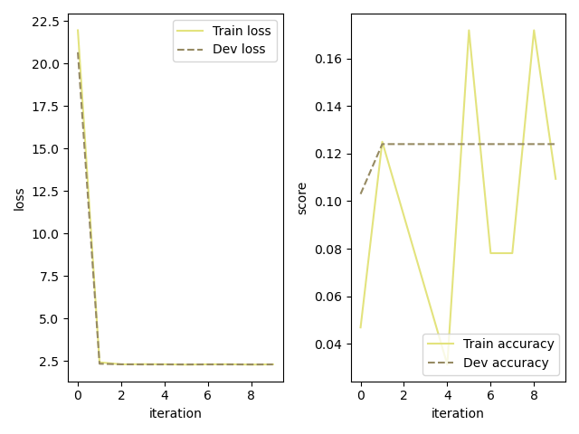

# MNIST手写数字识别项目报告

**王海天 223070140113**
代码仓库链接：[https://github.com/w-sky-w/NNDL-PJ1](https://github.com/w-sky-w/NNDL-PJ1)
模型参数网盘链接:[https://pan.baidu.com/s/1Fmao5R8x3U3bzL2kAqSHXw?pwd=sbni](https://pan.baidu.com/s/1Fmao5R8x3U3bzL2kAqSHXw?pwd=sbni)
数据集没有进行更改因此就不重复上传至网盘了

## 1. 项目简介

本项目旨在通过自实现的神经网络组件，完成对MNIST手写数字数据集的分类任务。实验内容涵盖了MLP与CNN两种模型结构，并系统性地探索了优化器、正则化、损失函数等多种训练技巧对模型性能的影响。

---

## 2. 数据集与预处理

- **数据集**：MNIST，包含60000张训练图片和10000张测试图片，每张图片为28x28灰度图。
- **预处理**：
  - 归一化到[0,1]
  - 划分训练集、验证集
  - 在使用CNN模型时，将输入reshape为`(batch, 1, 28, 28)`

```python
import numpy as np
from struct import unpack
import gzip
import pickle

# 读取数据
with gzip.open('train-images-idx3-ubyte.gz', 'rb') as f:
    magic, num, rows, cols = unpack('>4I', f.read(16))
    train_imgs = np.frombuffer(f.read(), dtype=np.uint8).reshape(num, 28*28)
with gzip.open('train-labels-idx1-ubyte.gz', 'rb') as f:
    magic, num = unpack('>2I', f.read(8))
    train_labs = np.frombuffer(f.read(), dtype=np.uint8)

# 划分验证集
idx = np.random.permutation(np.arange(num))
train_imgs = train_imgs[idx]
train_labs = train_labs[idx]
valid_imgs = train_imgs[:10000]
valid_labs = train_labs[:10000]
train_imgs = train_imgs[10000:]
train_labs = train_labs[10000:]

# 归一化
train_imgs = train_imgs / 255.0
valid_imgs = valid_imgs / 255.0
```

---

## 3. 阶段一：MLP基础实现与实验

### 3.1 任务目标

- 实现`Linear`层的前向与反向传播
- 构建MLP模型，实现对MNIST的分类

### 3.2 代码实现与思路

#### Linear层

- 前向传播：`output = X @ W + b`
- 反向传播：计算对输入、权重、偏置的梯度

因此在op.py中定义的Linear类中，有以下的方法具体实现

```python
def forward(self, X):        
    self.input = X  # Store input for use in backward pass
    # Compute linear transformation: XW + b
    output = np.dot(X, self.params['W']) + self.params['b']
    
    return output

def backward(self, grad : np.ndarray):
    batch_size = self.input.shape[0]
    
    # Compute gradient with respect to weights: dL/dW = X^T * dL/dY
    dW = np.dot(self.input.T, grad)
    if self.weight_decay:
        # Add L2 regularization gradient if weight decay is enabled
        dW += self.weight_decay_lambda * self.params['W']
    # Compute gradient with respect to bias: sum of gradients across batch
    db = np.sum(grad, axis=0, keepdims=True)
    # Compute gradient with respect to input: dL/dX = dL/dY * W^T
    dX = np.dot(grad, self.params['W'].T)
    
    # Store gradients for optimizer
    self.grads['W'] = dW
    self.grads['b'] = db

    return dX
```

#### MLP模型

- 结构：输入层-隐藏层-输出层
- 激活函数：ReLU
- 损失函数：交叉熵

```python
linear_model = nn.models.Model_MLP([train_imgs.shape[-1], 600, 10], 'ReLU', [1e-4, 1e-4])
optimizer = nn.optimizer.MomentGD(init_lr=0.06, model=linear_model, mu=0.9)
scheduler = nn.lr_scheduler.MultiStepLR(optimizer=optimizer, milestones=[800, 2400, 4000], gamma=0.5)
loss_fn = nn.op.MultiCrossEntropyLoss(model=linear_model, max_classes=train_labs.max()+1)
```

在损失函数的选择上，这里直接使用了`Question4`中提示的交叉熵损失函数`MultiCrossEntropyLoss`。这个损失函数的作用是计算每个batch的交叉熵损失，同时实现了softmax输出功能。具体forward和backward功能的代码实现如下：

```python
def forward(self, predicts, labels):
    """
    predicts: [batch_size, D]
    labels : [batch_size, ]
    This function generates the loss.
    """
    # / ---- your codes here ----/
    self.batch_size = predicts.shape[0]
    self.labels = labels
    
    # Apply softmax if needed
    if self.has_softmax:
        self.softmax_output = softmax(predicts)
    else:
        self.softmax_output = predicts
        
    # Convert integer labels to one-hot encoded vectors
    y_one_hot = np.zeros((self.batch_size, self.max_classes))
    for i in range(self.batch_size):
        y_one_hot[i, labels[i]] = 1
    
    # Compute cross-entropy loss with numerical stability
    epsilon = 1e-10  # Small constant to prevent log(0)
    log_likelihood = -np.log(self.softmax_output + epsilon)
    # Average loss over batch
    loss = np.sum(y_one_hot * log_likelihood) / self.batch_size
    
    return loss

def backward(self):
    # Convert labels to one-hot encoding
    y_one_hot = np.zeros((self.batch_size, self.max_classes))
    for i in range(self.batch_size):
        y_one_hot[i, self.labels[i]] = 1
    
    # Compute gradient of cross-entropy loss with respect to softmax outputs
    # dL/dx = (softmax(x) - y) / batch_size
    self.grads = (self.softmax_output - y_one_hot) / self.batch_size
    
    # Propagate gradients through the model
    self.model.backward(self.grads)
```

值得注意的是，这里使用了两个技巧：其一是计算似然对数损失时加上了微小常数`epsilon`以防止出现`log(0)`的情况；其二是在反向传播计算梯度时直接使用了softmax输出减去one-hot标签直接得到梯度，这是一种常见的简化计算的方法。

有了以上的MLP模型实现，我们就可以进行训练了。使用`test_train.py`文件中给出的训练方法进行训练，就可以得到MLP模型的baseline，保存为`\codes\best_models\best_model_baseline.pickle`。

最后使用`test_model.py`进行测试集上的测试，最终得到MLP模型的准确率baseline为93.3%。


接着我们尝试提升效果。

---

## 4. 阶段二：MLP模型优化实验

### 4.1 隐藏层单元数

首先可以按照Question1中提示的内容，对MLP模型的隐藏层单元数进行实验。我们可以尝试不同的隐藏层单元数，观察对模型性能的影响。

我依次选择了400、600（预设值）、1200作为`nHidden`的取值，分别训练了MLP模型，并记录了准确率、损失曲线。

当`nHidden = 400`时，准确率为93.68%，损失曲线如下：

当`nHidden = 1200`时，准确率为93.74%，损失曲线如下：


通过以上数据，我们不难发现，随着隐藏层单元数的增加，模型的准确率逐步提升。分析其原因，可以发现，MLP模型的隐藏层单元的增加使得模型能够学习到图片更复杂的特征，因此隐藏层单元数越多，模型的表达能力越强。

### 4.2 动量梯度下降

在Question2中提到了动量梯度下降（Momentum Gradient Descent），这是一种优化算法，它在SGD的基础上引入了动量项，使得梯度下降更加稳定、快速。因此我们尝试在MLP模型中使用动量梯度下降，并记录准确率、损失曲线。

首先，在`optimizer.py`中定义了MomentGD类，其初始化设定了动量项的初始值`mu`，并保存了模型最初的参数。接着，在step方法中，使用相应的计算公式：

$$v_{t+1} = \mu * v_t + (1 - \mu) * \nabla L(w_t)$$

$$w_{t+1} = w_t - \alpha * v_{t+1}$$

具体的代码实现如下：

```python
class MomentGD(Optimizer):
    def __init__(self, init_lr, model, mu):
        super().__init__(init_lr, model)
        self.mu = mu
        # Initialize velocity dictionary for each layer and parameter
        self.velocities = {}
        
        # Initialize velocities to zeros with the same shape as params
        for i, layer in enumerate(self.model.layers):
            if layer.optimizable:
                self.velocities[i] = {}
                for key in layer.params.keys():
                    self.velocities[i][key] = np.zeros_like(layer.params[key])
    
    def step(self):
        for i, layer in enumerate(self.model.layers):
            if layer.optimizable:
                for key in layer.params.keys():
                    # Update velocity: v = mu * v - learning_rate * gradient
                    self.velocities[i][key] = self.mu * self.velocities[i][key] - self.init_lr * layer.grads[key]
                    
                    # Apply weight decay if enabled
                    if layer.weight_decay:
                        layer.params[key] *= (1 - self.init_lr * layer.weight_decay_lambda)
                    
                    # Update parameters: params = params + velocity
                    layer.params[key] += self.velocities[i][key]
```

然后，在`test_train.py`中使用MomentGD优化器代替SGD训练MLP模型，其最终准确率为94.98%。损失曲线如下：


可以看到，使用动量梯度下降后，模型的准确率提升明显，且损失曲线更平滑，证明了动量梯度下降的有效性。

---

## 4. 阶段二：CNN模型探索

### 4.1 卷积层实现

在`op.py`中定义了Conv2D类，其中包含了前向传播和反向传播的实现。

#### 前向传播
前向传播的主要步骤是：
1. 计算输出特征图的尺寸
2. 对每个batch的每个样本，在每个输出通道上进行卷积操作

```python
def forward(self, X):        
    self.input = X  # Store input for backward pass
    batch_size, _, in_h, in_w = X.shape
    
    # Calculate output dimensions based on kernel size and stride
    out_h = (in_h - self.kernel_size[0]) // self.stride + 1
    out_w = (in_w - self.kernel_size[1]) // self.stride + 1
    
    # Initialize output tensor with zeros
    output = np.zeros((batch_size, self.out_channels, out_h, out_w))
    
    # Perform convolution operation
    for b in range(batch_size):
        for c_out in range(self.out_channels):
            for h_out in range(out_h):
                h_start = h_out * self.stride  # Calculate starting height position
                for w_out in range(out_w):
                    w_start = w_out * self.stride  # Calculate starting width position
                    
                    # Extract current patch from input volume
                    patch = X[b, :, h_start:h_start+self.kernel_size[0], w_start:w_start+self.kernel_size[1]]
                    
                    # Compute convolution as element-wise multiplication and sum
                    # Add bias term for current output channel
                    output[b, c_out, h_out, w_out] = np.sum(patch * self.params['W'][c_out]) + self.params['b'][c_out]

    return output
```

#### 反向传播
反向传播需要计算三个梯度：
1. 对卷积核权重的梯度 dW
2. 对偏置的梯度 db
3. 对输入的梯度 dX

```python
def backward(self, grads):      
    batch_size, _, out_h, out_w = grads.shape
    _, _, in_h, in_w = self.input.shape
    
    # Initialize gradient tensors
    dW = np.zeros_like(self.params['W'])
    db = np.zeros_like(self.params['b'])
    dX = np.zeros_like(self.input)
    
    # Compute gradients for each element
    for b in range(batch_size):
        for c_out in range(self.out_channels):
            for h_out in range(out_h):
                h_start = h_out * self.stride
                for w_out in range(out_w):
                    w_start = w_out * self.stride
                    
                    # Get current input patch
                    patch = self.input[b, :, h_start:h_start+self.kernel_size[0], w_start:w_start+self.kernel_size[1]]
                    
                    # Compute gradient for kernel weights: dL/dW = X * dL/dY
                    dW[c_out] += patch * grads[b, c_out, h_out, w_out]
                    
                    # Compute gradient for bias: dL/db = dL/dY
                    db[c_out] += grads[b, c_out, h_out, w_out]
                    
                    # Compute gradient for input: dL/dX = dL/dY * W
                    dX[b, :, h_start:h_start+self.kernel_size[0], w_start:w_start+self.kernel_size[1]] += \
                        self.params['W'][c_out] * grads[b, c_out, h_out, w_out]
    
    # Add L2 regularization gradient if weight decay is enabled
    if self.weight_decay:
        dW += self.weight_decay_lambda * self.params['W']
        
    # Store computed gradients
    self.grads['W'] = dW
    self.grads['b'] = db

    return dX
```

### 4.2 CNN模型实现

在`models.py`中实现了Model_CNN类，该类可以构建包含卷积层和全连接层的CNN模型。模型结构的定义通过`conv_params`和`fc_params`两个参数列表来指定：

```python
# CNN架构定义
conv_params = [
    (1, 8, 3, 1, 0, 1e-4),
    (8, 16, 3, 1, 0, 1e-4)
]

fc_params = [
    (16*24*24, 128, 1e-4),
    (128, 10, 1e-4)
]

cnn_model = Model_CNN(conv_params=conv_params, fc_params=fc_params, act_func='ReLU')
```

在实现模型内部结构的时候，需要注意，模型的前后向传播需要特别处理卷积层和全连接层之间特征的转换，需要将特征展平或压缩：

```python
def forward(self, X):
    assert self.layers is not None, 'Model has not been initialized yet. Use model.load_model to load a model or create a new model with conv_params and fc_params.'
    
    outputs = X
    self.shapes = [outputs.shape]  # Store the input shape for later reshape in backward
    
    for i, layer in enumerate(self.layers):
        layer_name = layer.__class__.__name__
        # If the current layer is Linear and input is not flat, flatten it
        if isinstance(layer, Linear) and len(outputs.shape) > 2:
            outputs = outputs.reshape(outputs.shape[0], -1)
        
        # Forward pass through the current layer
        outputs = layer(outputs)
        
        # Store the output shape after each layer for backward reshape
        self.shapes.append(outputs.shape)
    
    return outputs

def backward(self, loss_grad):
    grads = loss_grad
    reshape_indices = []
    
    # Identify the indices where reshape is needed (from conv2D to Linear)
    for i in range(len(self.layers)):
        if i > 0 and isinstance(self.layers[i-1], conv2D) and isinstance(self.layers[i], Linear):
            reshape_indices.append(i)
    
    # Backward pass through all layers in reverse order
    for i, layer in enumerate(reversed(self.layers)):
        layer_idx = len(self.layers) - 1 - i
        layer_name = layer.__class__.__name__
        
        # If this layer is right after a conv2D and before a Linear, reshape grads
        if layer_idx in reshape_indices:
            conv_output_shape = self.shapes[layer_idx]
            grads = grads.reshape(conv_output_shape)
        
        # If current layer is ReLU and previous is conv2D, ensure grads shape matches
        if isinstance(layer, ReLU):
            next_layer_idx = layer_idx - 1
            if next_layer_idx >= 0 and isinstance(self.layers[next_layer_idx], conv2D):
                if len(grads.shape) != len(self.shapes[layer_idx]):
                    grads = grads.reshape(self.shapes[layer_idx])

        # Backward pass through the current layer
        grads = layer.backward(grads)
    
    return grads
```

### 4.3 CNN实验结果

使用上述CNN模型在MNIST数据集上进行训练，配置如下：

```python
# 优化器设置
optimizer = nn.optimizer.MomentGD(init_lr=0.02, model=cnn_model, mu=0.9)

# 学习率调度
scheduler = nn.lr_scheduler.MultiStepLR(
    optimizer=optimizer, 
    milestones=[300, 600, 1000],
    gamma=0.5
)

# 损失函数
loss_fn = nn.op.MultiCrossEntropyLoss(model=cnn_model, max_classes=10)

# 训练参数
batch_size = 64
num_epochs = 5
```

然而在训练过程中，CNN的效果并不理想。我在实验过程中遇到了两个问题：首先是CNN的训练速度极其缓慢，受限于其卷积层结构中定义的四层嵌套循环，且整体架构依赖于cpu计算，导致CNN的训练速度远低于MLP模型。其次是CNN模型的损失值和准确率在训练过程中出现了反常是情况：损失值从20降低到2.3后几乎不变，而准确率始终维持在18%左右，这说明模型的训练出现了问题，但我反复检查，代码没有发现明显错误。我也尝试了改变不同的超参数，但均没有效果。在钻研许久之后，我试图借助AI纠正错误，但最后也以失败告终。

